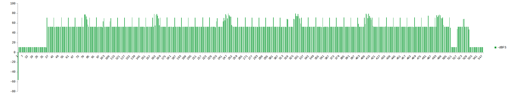

# FFmpeg patch/extension for embedding audio loudness data in an HLS playlist

## Synopsis

This is an experimental patch for ffmpeg/libavformat 4.4 that adds some additional options to allow embedding of loudness data in an HLS playlist with a custom `EXT-X-LOUDNESS` header attached to every segment.

## Why?

1) As a learning exercise in order to better understand the ffmpeg stack
2) For testing whether it is feasible to use server-side generated audio visualizations in web applications (possibly in conjuction with [hls.js](https://github.com/video-dev/hls.js/)

## How?

After applying the patch, you can try out something like (for VOD):

```
./ffmpeg -i /tmp/test.flac -f hls -hls_audio_peaks true -hls_playlist_type vod /tmp/stream.m3u8
```

For live HLS, the following may be used instead:

```
./ffmpeg -i "https://stream.nightride.fm/darksynth.m4a" -f hls -hls_audio_peaks true -hls_time 4 -hls_flags delete_segments /tmp/stream.m3u8
```

## What?

The following options are added to the HLS muxer:

- `hls_audio_peaks false|true (defaults to false) => toggles loudness embedding in the HLS playlist`
- `hls_audio_peaks_window <n> (defaults to n=1000) => window size for loudness calculation`
- `hls_audio_peaks_rate <n> (defaults to n=8000) => sample rate for loudness calculation`

## How does it look like?

Like this. Each segment gets an `EXT-X-LOUDNESS` containing a CSV row of data points that may be used for visualisation purposes. The unit of measurement is dBFS.

```
#EXTM3U
#EXT-X-VERSION:3
#EXT-X-TARGETDURATION:2
#EXT-X-MEDIA-SEQUENCE:0
#EXT-X-PLAYLIST-TYPE:VOD
#EXT-X-LOUDNESS-INF:UNIT=dBFS,SPP=0.1250
#EXTINF:2.048000,
#EXT-X-LOUDNESS:-96.7,-69.2,-69.3,-69.2,-69.4,-69.3,-69.3,-69.4,-69.4,-69.3,-69.4,-69.4,-69.4,-69.3,-69.3,-69.4,-69.4
stream0.ts
#EXTINF:2.048000,
#EXT-X-LOUDNESS:-69.3,-69.3,-69.4,-69.4,-69.4,-69.3,-69.3,-69.4,-69.4,-69.3,-69.4,-69.4,-69.4,-69.3,-69.3,-69.4,-69.7
stream1.ts
#EXTINF:1.920000,
#EXT-X-LOUDNESS:-8.8,-27.8,-27.6,-27.5,-27.5,-27.5,-27.5,-27.6,-8.7,-27.9,-27.6,-27.5,-27.5,-27.5,-27.5,-28.2
stream2.ts
#EXTINF:2.048000,
#EXT-X-LOUDNESS:-27.5,-8.6,-27.6,-27.5,-27.6,-27.7,-27.6,-27.6,-27.6,-9.0,-27.7,-27.5,-27.6,-27.6,-27.6,-27.6,-27.4
stream3.ts
#EXTINF:2.048000,
#EXT-X-LOUDNESS:-8.9,-27.8,-27.6,-27.6,-27.6,-27.5,-27.5,-27.6,-8.8,-27.8,-27.6,-2.2,-2.2,-6.6,-12.5,-23.0,-27.7
stream4.ts
#EXTINF:1.920000,
#EXT-X-LOUDNESS:-8.9,-27.8,-27.5,-27.5,-27.5,-27.5,-27.6,-27.6,-8.6,-27.9,-27.5,-27.6,-27.5,-27.5,-27.6,-28.4
stream5.ts
#EXTINF:2.048000,
#EXT-X-LOUDNESS:-16.6,-9.7,-27.6,-27.5,-27.6,-27.6,-27.6,-27.7,-16.6,-9.7,-27.5,-27.6,-27.6,-27.7,-27.6,-27.6,-27.5
stream6.ts
#EXTINF:1.920000,
#EXT-X-LOUDNESS:-8.8,-27.8,-27.6,-27.6,-27.6,-27.5,-27.5,-27.5,-8.7,-27.8,-27.6,-27.6,-27.6,-27.5,-27.5,-27.7
stream7.ts
#EXTINF:2.048000,
#EXT-X-LOUDNESS:-27.6,-8.6,-27.6,-27.5,-27.5,-27.6,-27.6,-27.6,-27.7,-8.9,-27.8,-27.5,-27.5,-27.6,-27.6,-27.7,-27.9
stream8.ts
#EXTINF:2.048000,
#EXT-X-LOUDNESS:-8.9,-27.7,-27.6,-27.6,-27.6,-27.6,-27.6,-27.7,-8.8,-27.7,-1.5,-25.1,-3.3,-1.6,-4.9,-10.3,-24.6
stream9.ts
#EXTINF:1.920000,
#EXT-X-LOUDNESS:-8.8,-27.8,-27.6,-27.6,-27.5,-27.5,-27.5,-27.5,-8.6,-27.9,-27.6,-27.6,-27.5,-27.5,-27.5,-28.1
stream10.ts
#EXTINF:2.048000,
#EXT-X-LOUDNESS:-27.7,-8.9,-27.6,-27.5,-27.6,-27.6,-27.6,-27.8,-27.9,-8.9,-27.5,-27.5,-27.6,-27.6,-27.6,-27.6,-27.6
stream11.ts
#EXTINF:2.048000,
#EXT-X-LOUDNESS:-8.8,-27.7,-27.6,-27.7,-27.7,-27.6,-27.5,-27.6,-9.0,-27.8,-27.6,-27.6,-27.6,-27.6,-27.5,-27.5,-27.4
stream12.ts
#EXTINF:1.920000,
#EXT-X-LOUDNESS:-8.6,-27.8,-27.6,-27.5,-27.5,-27.5,-27.5,-27.6,-8.6,-27.9,-27.6,-27.5,-27.5,-27.5,-27.6,-28.5
stream13.ts
#EXTINF:2.048000,
#EXT-X-LOUDNESS:-16.6,-9.7,-27.6,-27.6,-27.6,-27.6,-27.6,-27.8,-16.3,-9.6,-14.5,-1.7,-4.5,-10.4,-0.6,-3.8,-6.2
stream14.ts
#EXTINF:1.920000,
#EXT-X-LOUDNESS:-6.7,-23.8,-26.7,-27.6,-27.6,-27.5,-27.5,-27.5,-8.7,-27.9,-27.7,-27.6,-27.6,-27.5,-27.5,-27.7
stream15.ts
#EXTINF:2.048000,
#EXT-X-LOUDNESS:-27.6,-8.6,-27.6,-27.5,-27.5,-27.6,-27.6,-27.7,-27.7,-8.9,-27.8,-27.5,-27.5,-27.5,-27.6,-27.6,-28.2
stream16.ts
#EXTINF:2.048000,
#EXT-X-LOUDNESS:-8.8,-27.7,-27.5,-27.6,-27.6,-27.7,-27.6,-27.6,-8.9,-27.7,-27.5,-27.6,-27.6,-27.7,-27.6,-27.6,-27.1
stream17.ts
#EXTINF:1.920000,
#EXT-X-LOUDNESS:-8.6,-27.8,-27.6,-27.6,-27.6,-27.5,-27.5,-27.6,-8.9,-27.9,-27.6,-27.6,-27.6,-27.5,-27.6,-28.1
stream18.ts
#EXTINF:2.048000,
#EXT-X-LOUDNESS:-11.5,-12.4,-27.6,-27.5,-27.5,-27.6,-27.6,-27.8,-11.2,-12.4,-0.3,-5.2,-5.8,-1.5,-5.9,-10.4,-20.9
stream19.ts
#EXTINF:2.048000,
#EXT-X-LOUDNESS:-8.9,-27.7,-27.5,-27.6,-27.6,-27.6,-27.6,-27.5,-8.6,-27.7,-27.6,-27.6,-27.6,-27.6,-27.6,-27.5,-27.2
stream20.ts
#EXTINF:1.920000,
#EXT-X-LOUDNESS:-8.6,-27.8,-27.6,-27.6,-27.5,-27.5,-27.6,-27.9,-8.9,-27.9,-27.6,-27.6,-27.5,-27.5,-27.6,-28.4
stream21.ts
#EXTINF:2.048000,
#EXT-X-LOUDNESS:-8.8,-27.7,-27.5,-27.5,-27.5,-27.6,-27.6,-27.7,-8.8,-27.8,-27.5,-27.5,-27.5,-27.6,-27.6,-27.7,-27.6
stream22.ts
#EXTINF:1.920000,
#EXT-X-LOUDNESS:-8.6,-27.7,-27.6,-27.6,-27.6,-27.6,-27.6,-27.6,-8.9,-27.7,-27.6,-27.6,-27.6,-27.6,-27.6,-27.4
stream23.ts
#EXTINF:2.048000,
#EXT-X-LOUDNESS:-9.1,-21.5,-27.6,-27.6,-27.5,-27.5,-27.5,-27.6,-8.9,-21.8,-0.8,-2.6,-10.1,-0.8,-5.5,-9.0,-13.0
stream24.ts
#EXTINF:2.048000,
#EXT-X-LOUDNESS:-8.9,-25.5,-27.5,-27.5,-27.6,-27.6,-27.6,-27.6,-8.6,-27.7,-27.5,-27.5,-27.6,-27.6,-27.6,-27.6,-27.2
stream25.ts
#EXTINF:1.920000,
#EXT-X-LOUDNESS:-8.6,-27.8,-27.6,-27.7,-27.6,-27.6,-27.6,-27.8,-8.9,-27.8,-27.6,-27.6,-27.6,-27.6,-27.6,-27.8
stream26.ts
#EXTINF:2.048000,
#EXT-X-LOUDNESS:-8.8,-27.8,-27.6,-27.5,-27.5,-27.5,-27.6,-27.7,-8.9,-27.9,-27.6,-27.5,-27.5,-27.6,-27.5,-27.6,-28.0
stream27.ts
#EXTINF:2.048000,
#EXT-X-LOUDNESS:-8.6,-27.6,-27.5,-27.5,-27.6,-27.6,-27.6,-27.7,-8.9,-27.7,-27.5,-27.5,-27.6,-27.6,-27.7,-27.9,-4.8
stream28.ts
#EXTINF:1.920000,
#EXT-X-LOUDNESS:-27.7,-27.6,-27.6,-27.7,-27.6,-27.6,-27.6,-8.8,-27.8,-3.7,-7.5,-4.2,-2.3,-4.1,-9.1,-10.5
stream29.ts
#EXTINF:2.048000,
#EXT-X-LOUDNESS:-8.5,-24.0,-27.5,-27.5,-27.5,-27.5,-27.6,-27.7,-8.6,-29.4,-68.8,-69.2,-69.4,-69.3,-69.4,-69.4,-69.2
stream30.ts
#EXTINF:1.920000,
#EXT-X-LOUDNESS:-32.3,-27.5,-27.5,-27.5,-27.6,-27.6,-27.8,-12.2,-11.6,-27.5,-27.5,-27.5,-27.6,-27.6,-33.2,-69.3
stream31.ts
#EXTINF:1.792000,
#EXT-X-LOUDNESS:-69.3,-69.4,-69.3,-69.3,-69.3,-69.4,-69.3,-69.2,-69.3,-69.4,-69.3,-69.2,-69.3,-69.3,-69.3
stream32.ts
#EXT-X-ENDLIST
```

Live HLS playlists will include only the segments in the HLS window and the associated peak data:

```
#EXTM3U
#EXT-X-VERSION:3
#EXT-X-TARGETDURATION:4
#EXT-X-MEDIA-SEQUENCE:3
#EXT-X-LOUDNESS-INF:UNIT=dBFS,SPP=0.1250
#EXTINF:4.017044,
#EXT-X-LOUDNESS:-7.6,-15.1,-13.2,-12.4,-12.1,-14.2,-15.3,-12.7,-12.5,-14.3,-22.6,-27.3,-27.5,-29.2,-23.5,-24.1,-19.5,-14.7,-14.5,-8.9,-12.8,-12.8,-11.0,-10.7,-8.1,-13.7,-11.8,-11.2,-10.4,-8.1,-16.4,-13.9,-15.4
stream3.ts
#EXTINF:3.993833,
#EXT-X-LOUDNESS:-13.0,-9.1,-10.2,-13.8,-10.8,-10.1,-8.8,-12.9,-13.4,-11.3,-10.8,-8.1,-15.4,-16.4,-15.6,-14.5,-7.5,-14.0,-11.9,-11.6,-10.1,-8.8,-14.4,-10.5,-10.5,-9.4,-10.7,-12.8,-11.2,-10.6,-8.9,-12.0
stream4.ts
#EXTINF:3.993833,
#EXT-X-LOUDNESS:-12.6,-10.7,-10.5,-8.1,-14.9,-14.3,-13.3,-12.9,-8.0,-14.4,-12.4,-11.0,-10.3,-8.5,-13.7,-10.6,-10.8,-9.3,-10.3,-18.8,-14.4,-13.9,-8.8,-12.1,-17.9,-12.0,-12.6,-8.4,-12.9,-11.7,-12.0,-11.6
stream5.ts
#EXTINF:3.993833,
#EXT-X-LOUDNESS:-8.2,-17.2,-14.6,-12.6,-12.6,-7.8,-15.5,-11.5,-12.9,-10.2,-9.8,-15.0,-13.4,-13.0,-8.9,-11.4,-14.3,-11.9,-11.2,-8.7,-13.6,-13.4,-12.7,-10.5,-8.2,-15.9,-16.7,-15.1,-15.0,-8.0,-15.1,-11.9
stream6.ts
#EXTINF:4.017056,
#EXT-X-LOUDNESS:-11.5,-9.8,-9.4,-15.0,-10.6,-10.0,-9.4,-11.1,-14.4,-11.1,-11.5,-9.0,-13.0,-13.2,-11.4,-11.5,-8.4,-15.9,-14.0,-13.4,-12.9,-7.9,-14.5,-10.7,-10.7,-10.0,-9.8,-13.6,-10.9,-11.1,-9.3,-11.4,-16.2
stream7.ts
```

# Plot

For verification/demo purposes, we convert the peak output from the VOD example into a single-column, plottable CSV:

```
grep '^#EXT-X-LOUDNESS:' /tmp/stream.m3u8 | cut -d: -f2 | tr '\n' ',' | paste -s | tr ',' '\n' | LANG=C awk '!/^\s*$/ { print($1 + 80) }' > /tmp/test.csv
```



# Disclaimer

This is experimental code and no guarantee, warranty or support is provided whatsoever.
